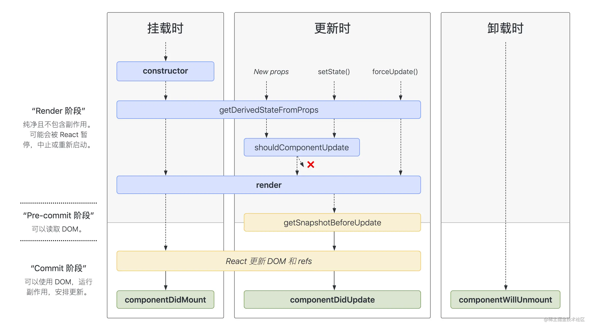

#### cdn地址

```html
<script crossorigin src="https://unpkg.com/react@16/umd/react.development.js"></script>
<script crossorigin src="https://unpkg.com/react-dom@16/umd/react-dom.development.js"></script>
<script src="https://unpkg.com/@babel/standalone/babel.min.js"></script>
<script src="https://unpkg.com/prop-types@15.6/prop-types.js"></script>
```


#### JSX

```tex
1. 不要写引号
2. 使用js表达式时使用{}
3. 指定类名使用className
4. 内联样式使用 style = { {color:"red",fontSize:"18px"} } // 其实就是使用对象的形式，读取js需要{}
5. 只能有一个根标签
6. 标签必须闭合
7. 组件首字母大写
```


#### 组件

- 函数式组件

  ```jsx
  function MyComponent(){
      return <h1>函数式组件<>
  }
  
  ReactDOM.render(<MyComponent />, document.getElementById('test'))
  ```

  ```tex
    调用React.render后，找到了 MyComponent 组件，发现是函数式组件，调用函数得到虚拟DOM，渲染到页面上。
  ```

  

- 类组件

```jsx
class MyComponent extends React.Component{
    constructor(props){
        super(props)
    }
    
    render(){
        return <h1>类组件</h1>
    }
}

ReactDOM.render(<MyComponent />, document.getElementById('test'))
```

```tex
  调用React.render后，找到了 MyComponent 组件，发现是类组件，React 执行new MyComponment，并调用原型对象上的render函数，得到虚拟DOM，渲染到页面上。
```


#### 组件实例三大属性


##### state

```jsx
class MyComponent extends React.Component{
    constructor(props){
        super(props)
        this.state = {
            isHot: true
        }
        this.handleClick = this.handleClick.bind(this)
    }
    render(){
        return <h1 onClick={this.handleClick}>今天天气很{this.state.isHot ? '炎热' : '凉爽'}</h1>
    }
    
    handleClick(){
        this.setState({isHot:!this.state.isHot})
    }
}

ReactDOM.render(<MyComponent />,document.getElementById('root')) 
```

```js
this.setState()
```


##### props

注意：props是只读的，修改props的属性会报错

```jsx
const person = {name:'joke',age:18,sex:'男'}
ReactDOM.render(<MyComponent name={person.name} age={person.age} sex={person.sex} />,document.getElementById('root'))
// 简写形式，当props很多时，可以批量添加属性
// 原生js不支持，jsx中支持
ReactDOM.render(<MyComponent {...person} />,document.getElementById('root'))
```


`props的类型检查`

需要先引入prop-types.js

再给类自身加上属性

```jsx
class MyComponent extends React.Component{
    render(){
        return <h1></h1>
    }
}
// props类型检查
MyComponent.propTypes = {
  name:PropTypes.string.isRequired, // 类型为string，且为必须props
  age:PropTypes.number, // 类型为number
  sex:PropTypes.string,
  // fn:PropTypes.func // function类型为func
}

// props默认值
MyComponent.defaultProps = {
  age:18,
  sex:'未知'
}

ReactDOM.render(<MyComponent name="张三" age={18} />,document.getElementById('root'))
```


##### ref

- 字符串形式的ref

  ```jsx
  class demo extends React.Component{
      getData = ()=>{
          console.log(this.refs.input1)
      }
      render(){
          return (
          	<div>
                  <input type='text' ref='input1' />
              	<button onClick={this.getData}></button>
              </div>
          )
      }
  }
  ```

  ```tex
  缺点：效率不高，可能被弃用
  ```

  

- 回调函数形式的ref

  ```jsx
  class demo extends React.Component{
      saveInput = (c) => {
          this.input1 = c
      }
      getData = () => {
          console.log(this.input1.value)
      }
      render(){
          return (
          	<div>
                  {/* 直接传入一个函数，更新时他每次都会调用这个函数两次（第一次渲染正常），第一					次传入null，第二次传入节点。
                  	传入一个定义好的方法作为回调不会有这个问题，一般将这个方法存在原型对象上
                  */}
                  {/*<input type='text' ref={c=>this.input1 = c} />*/}
                  <input type='text' ref={this.saveInput} />
              	<button onClick={this.getData}></button>
              </div>
          )
      }
  }
  ```

  

- creatRef

```tex
使用 React.creatRef() 会返回一个容器，可以用来存储ref标识的节点
```

```jsx
class Demo extends React.Component{
    myRef = React.creatRef()
    getData = () => {
        // 这样就可以拿到
        console.log(this.myRef.current.value)
    }
    render(){
        return (
            <input type='text' ref={this.myRef} />
            <button onClick={this.getData}></button>
        )
    }
}
```

注意：不要滥用ref

#### 事件处理

```tex
1.重写了原生dom事件
2.采用事件委托的形式
```


非受控组件

```jsx
// 输入的组件通过ref，现用现取
class Demo extends React.Component{
  formSubmit = (e)=>{
    e.preventDefault()
    const {username, password} = this.refs
    console.log(`用户名：${username.value}密码：${password.value}`);
  }
  render(){
    return (
      <form onSubmit={this.formSubmit}>
        用户名：<input ref='username' type="text" name='username' />
        密码：<input ref='password' type="password" name='password' />
        <button>提交</button>
      </form>
    )
  }
}
ReactDOM.render(<Demo />,document.getElementById('root'))
```


受控组件

```jsx
// 将数据保存在state中
class Demo extends React.Component{
    state = {
      username:'',
      password:''
    }
  saveUsername = (e)=>{
    this.setState({username:e.target.value})
  }
  savePassword = (e)=>{
    this.setState({password:e.target.value})
  }
  formSubmit = (e)=>{
    e.preventDefault()
    const {username, password} = this.state
    console.log(`用户名：${username}密码：${password}`);
  }
  render(){
    return (
      <form onSubmit={this.formSubmit}>
        用户名：<input onChange={this.saveUsername} type="text" name='username' />
        密码：<input onChange={this.savePassword} type="password" name='password' />
        <button>提交</button>
      </form>
    )
  }
}
ReactDOM.render(<Demo />,document.getElementById('root'))
```


当需要对很对数据进行处理时，使用函数柯里化的办法传递参数，同用一个函数

```jsx
class Demo extends React.Component{
  state = {
    username:'',
    password:''
  }
  saveFormData= (name)=>{
    return (e)=>{
      this.setState({[name]:e.target.value})
    }
  }

  formSubmit = (e)=>{
    e.preventDefault()
    const {username, password} = this.state
    console.log(`用户名：${username}密码：${password}`);
  }
  render(){
    return (
      <form onSubmit={this.formSubmit}>
        用户名：<input onChange={this.saveFormData('username')} type="text" name='username' />
        密码：<input onChange={this.saveFormData('password')} type="password" name='password' />
        <button>提交</button>
      </form>
    )
  }
}
ReactDOM.render(<Demo />,document.getElementById('root'))
```


#### 生命周期

旧版本：

- 初始化

componentWillMount

render

componentDidMount


- 更新

componentWillReceiveProps （ 初始化不算 ）

shouldComponentUpdate

componentWillUpdate

render

componentDidUpdate


- 卸载

主动调用 ReactDOM.unmountComponmentAtNode()

componentWillUnmount

```jsx
componentWillMount: 组件挂载前调用
render: 返回jsx
componentDidMount: 组件挂载后

父组件更新：
componentWillReceiveProps: 组件结束接收的props的值发生改变，参数是props （ 初始化不算 ）
shouldComponentUpdate: 调用this.setState后，是否应该更新组件，根据本函数的返回值判断，默认为true
componentWillUpdate: 组件更新前
render： 重新渲染
componentDidUpdate(prevProps, prevState, snapshot)： 组件更新后

调用forceUpdate后，直接进入componentWillUpdate，无需判断
```


新版本：

```js
将componentWillMount, componentWillReceiveProps, componentWillUpdate加上UNSAFE_前缀
加入两个新钩子：
  static getDerivedStateFromProps( props, state) 在初始化和更新时分别用来代替componentWillMount,和componentWillReceiveProps,该方法需要返回一个对象，用来代替state，或者返回null，代表不更新任何内容（一般适用于情形：state 的值在任何时候都取决于 props）
  getSnapshotBeforeUpdate(prevProps, prevState) 在更新时被增加到render和componentDidUpdate之间，用于更新前获取快照
```




`getSnapshotBeforeUpdate`使用场景：

```jsx
// 通过修改元素的scrollTop属性，让内容不动
class NewsList extends React.Component{
state = {newsArr:[]}
getElementList = (c)=>{
  this.list = c
}
componentDidMount(){
  // 设置定时器，每500ms多渲染一个div
  setInterval(()=>{
    const {newsArr} = this.state
    const news = `新闻${newsArr.length+1}`
    this.setState({newsArr:[news,...newsArr]})
  },500)
}
getSnapshotBeforeUpdate(){
  // 更新前返回此时元素的内容区域高度
  return this.list.scrollHeight
}
componentDidUpdate(preProps,preState,height){
  // 修改scrollTop
  this.list.scrollTop += this.list.scrollHeight - height
}
render(){
  return (
    <div className="list" ref={this.getElementList}>
      {this.state.newsArr.map((v,i)=><div className="news" key={i}>{v}</div>)}  
    </div>
  )
}
}
ReactDOM.render(<NewsList  />,document.getElementById('root'))
```


#### diff算法

diff算法中key的作用：

```tex
  当状态（state）中的数据发送改变时，react会根据新数据生成新的虚拟dom，随后将新的虚拟dom与旧的虚拟dmo进行diff比较，规则如下：
a.旧虚拟dom中找到与新虚拟dom中相同的key：
  1.若虚拟dom没变，直接使用之前的真实dom
  2.改变了，则生成新的真实dom,随后替换掉之前的真实dom
b.虚拟dom中未找到与新虚拟dom中相同的key：
  1.根据新虚拟dom生成真实dom，渲染
```


使用index作为key可能引发的问题：

```tex
1.若对数据进行一些改变顺序的操作，会产生没必要的更新，效率低
2.若结构中还包括输入类的dom，渲染还会产生错误
```


#### 脚手架


##### 解决样式冲突

```tex
所有样式都会被引入index.js，后引入的就会覆盖先引入的
解决方法：
1.给组件最外面的div加一个类目，然后里面的类名嵌套进去
2.css的模块化
import Hello from './css/Hello.moudle.css'

.title{
	background-color:red
}
使用时需要
render(){
    return (
        <div>
        	<h1 className={Hello.title}>hello</h1>
        </div>
    )
}
```


##### TodoList案例


##### 组件间通信

发布订阅 pubsub.js


##### fetch

- 原生方法，不使用XMLHttpRequest对象
- 老版本浏览器可能不兼容

```js
async fetchTest(){
    
}
```


#### react-router-dom

##### 旧版本

```bash
npm i react-router-dom
```


###### 路由的基本使用


```jsx
import {Link,Route} from 'react-router-dom';

import Home from './component/Home'
import About from './component/About'
.....
{/* 点击切换路由 */}
<Link to="home">home</Link>
<Link to="about">about</Link>

{/* 显示路由组件 */}
<Route path='/home' component={Home} />
<Route path='/about' component={About} />
```

注意：需要使用BrowserRouter包裹，对路由进行管理

```jsx
import React from 'react';
import ReactDOM from 'react-dom/client';
import {BrowserRouter} from 'react-router-dom'
import './index.css';
import App from './App';

const root = ReactDOM.createRoot(document.getElementById('root'));
root.render(
    <BrowserRouter>
      <App />
    </BrowserRouter>
);
```


###### 路由组件和一般组件


###### NavLink与封装NavLink


###### switch组件

```jsx
<Switch>
    <NavLink to="/home" component={Home}>home</NavLink>
    <NavLink to="/about" component={About}>about</NavLink>
    <NavLink to="/about" component={Test}>Test</NavLink>
</Switch>
// react路由默认会匹配所有匹配的路由，即路由为/about时，About和Test组件都显示
// 使用Switch包裹匹配到第一个就会终止匹配，提高效率
```


###### history路由模式刷新样式丢失解决：

```te
1. 引入css的地址 不要使用 ./index.css 而是 / index.css
2. 引入地址使用 %PUBLIC_URL%index.js
3. 使用hash模式
```


###### 路由的模糊匹配和严格匹配

```te
1. 默认开启模糊匹配（输入的路径要包含匹配的路径，并且顺序需要一致）
2. 开启严格匹配 <Route exact={true} path='/about' component={About} />
3. 严格模式不能随便开启，有时会导致无法继续匹配二级路由
```


###### Redirect组件

```jsx
<Switch>
    <NavLink to="/home" component={Home}>home</NavLink>
    <NavLink to="/about" component={About}>about</NavLink>
    <Redirect to="/home" />
</Switch>
//  一般写在所有路由注册的最下方，当所有路由都无法匹配的时候，重定向到指定路由
```


###### 向路由组件传值

1. params传值

```jsx
<Link to={`/home/message/1/message1`}></Link>

<Route path="/home/message/:id/:title" component={Detail} />
// 此时detail组件的props中就会带有id和title的值
// 存放再this.props.match.params 当中
```


2. search传值

```jsx
<Link to="/home/message?id=1&title=message1"></Link>

<Route path="/home/message" component={Detail} />
// 无需接收
// 存放在this.props.location.search中，是个字符串，需要使用querystring处理成对象形式
```


2. state传值

```jsx
<Link to={path:"/home/message",state={id:1,title:"message1"}}></Link>

<Route path="/home/message" component={Detail} />
// 无需接收
// 存放在this.props.location.state中
```


###### 编程式路由导航

```jsx
// 给元素绑定事件，操作history对象
// 传值方式不变，params和search参数直接写在path中，state参数则在state
this.props.history.push( path,state )
this.props.history.replace( path,state )
```


###### withRouter

```jsx
//一般组件不能直接操作react封装好的history对象
// 使用withRouter方法即可
import {withRouter} from 'react-router-dom'
class Test extends React.Component{
    back = ()=>{
        this.props.history.goBack()
    }
    render(){
        return <button onClick={this.back}>回退</button>
    }
}
// 返回一个withRouter加工过的新组件
export default withRouter( Test )
```


###### 两种路由模式对比


##### 新版本


###### Routes和Route


###### Navigate


###### NavLink


###### Outlet

相当于vue中的<router-view />


###### *useRoutes

```jsx
// 创建路由表
// 传入一个路由表对象
const element = useRoutes(obj)
//再将element放在jsx中 
{element}
```


###### *useNavigate

```jsx
// 用于编程式路由导航
const navigate = useNavigate()
/*
	params:
		path  路径
		option 设置对象，配置repalce和state
	也可以直接传入数字代表前进后退
*/
```


###### *useParams

```jsx
// 获取路由的params参数
const params = useParams()
```


###### *useSearchParams

```jsx
// 用于获取路由的search参数（query）和改变search的方法
const [search,setSearch] = useSearchParams()
// 调用search的get方法获取对应search参数
// 调用setSearch修改search参数
```


###### *useLocation

```jsx
// 获取路由的location对象
```


###### *useMatch

```jsx
// 获取路由的match对象
// 返回当前匹配信息
// 传入存在的路径
useMatch('/about/message/detail')
```


###### useInRouterContext

```tex
判断是否在路由环境中，返回一个布尔值
被BrowserRouter或者HashRouter就算在路由环境中
```


###### useNavigationType

```tex
返回POP,POSH，REPLACE
POP :直接进入
PUSH：push进入
REPLACE: repalce进入
```


###### useOutlet


###### useResolvedPath

```tex
// 解析一个路径
useResolvedPath('/asd?id=1#12')
// {"pathname":"/asd","search":"?id=1","hash":"#12"}
```


#### ant-design组件库

下载包：

```bash
npm i antd
```

使用时只需查看官网文档，按需引入组件和样式

引入样式：修改 `src/App.css`，在文件顶部引入 `antd/dist/antd.css`。

```css
@import '~antd/dist/antd.css';
```


#### redux

三大核心概念：

- action

  ```te
  用于创建action对象{type:'',data:data} ,也可以创建函数，用于异步(需要安装中间件)
  ```

  

- store

  ```tex
  将state,action,reducer联系在一起
  ```

  

- reducer

  ```tex
  初始化，处理state
  根据旧的state和action，返回新的state
  ```


示例：

`store.jsx`

```jsx
import { createStore,applyMiddleware } from "redux";
import countReducer from "./count-reducer.js";
import thunk from 'redux-thunk'

export default createStore(countReducer,applyMiddleware(thunk))
```


`count-action.jsx`

```jsx
import {INCREMENT,DECREMENT} from './constant'
/* ./constant.js
    export const DECREMENT = 'decrement'
    export const INCREMENT = 'increment'
*/

export const createIncrement = (data)=>({type:INCREMENT,data})

export const createDecrement = (data)=>({type:DECREMENT,data})

export const createIncrementAsync = (data,time)=>{
  return (dispatch)=>{
    setTimeout(()=>{
      console.log('async');
      dispatch(createIncrement(data))
    },time)
  }
}
```


`count-reducer.jsx`

```jsx
const state = {
  count:0
}

export default function countReducer(preState=state,action){
  const {type,data} = action
  console.log(preState);
  console.log(action);
  switch (type) {
    case 'increment':
      return Object.assign({},preState,{count:preState.count+data})
    case 'decrement':
      return Object.assign({},preState,{count:preState.count-data})
    default:
      return preState
  }
}
```


`count.jsx`

```jsx
import React, { Component } from 'react';
import store from '../../redux/store'
import {createIncrement,createDecrement,createIncrementAsync} from '../../redux/count-action'

class Count extends Component {
  // state改变就重新渲染
  componentDidMount(){
    store.subscribe(()=>{
      this.setState({})
    })
  }
  // 拿到option元素
  getOption = (c) => {
    this.option = c
  }
  // 加
  increment = () => {
    const value = this.option.value
    store.dispatch(createIncrement(Number(value)))
  }
  // 减
  decrement = () => {
    const value = this.option.value
    store.dispatch(createDecrement(Number(value)))
  }
  // 奇数加
  incrementIfOdd = () => {
    if(store.getState().count%2){
      const value = this.option.value
      store.dispatch(createIncrement(Number(value)))
    }
  }
  // 500ms后加
  incrementAsync = () => {
    // 在组件中异步加操作
    // setTimeout(()=>{
    //   const value = this.option.value
    //   store.dispatch(createIncrement(Number(value)))
    // },500)

    // 在action中进行异步操作
    const value = this.option.value
    store.dispatch(createIncrementAsync(Number(value),500))
  }
  render() {
    return (
      <div>
        <h1>结果为：{store.getState().count}</h1>
        <select ref={this.getOption}>
          <option value="1">1</option>
          <option value="2">2</option>
          <option value="3">3</option>
        </select>
        <button onClick={this.increment}>+</button>
        <button onClick={this.decrement}>-</button>
        <button onClick={this.incrementIfOdd}>总数为奇数时+</button>
        <button onClick={this.incrementAsync}>500ms后+</button>
      </div>
    );
  }
}

export default Count;

```


#### react-redux


注意：

```tex
1. react-redux需要redux
2. 创建一个containers文件夹，放容器组件，与UI组件建立连接并且传入props
3. 引用容器组件时要将store作为props传入
4. 不需要再调用store.subscribe重新渲染组件，react-redux内部实现了该功能
```


`containers/Count.jsx`：容器组件

```jsx
import {connect} from 'react-redux';
import countUI from '../../components/Count-react-redux'
import {createIncrement,createDecrement,createIncrementAsync} from '../../redux/count-action'

// 返回一个普通对象，就是要传个ui组件的props的属性,调用时会传入state
const mapStateToProps = (state) => {
  return {count:state.count}
}

// 返回一个普通对象，就是要传个ui组件的props的方法,调用时会传入dispatch
const mapDispatchToProps = (dispatch) => {
  return {
    increment:(value)=>dispatch(createIncrement(value)),
    decrement:(value)=>dispatch(createDecrement(value)),
    createIncrementAsync:(value,time)=>dispatch(createIncrementAsync(value,time))
  }
}
// mapDispatchToProps也可以是一个对象，只需要提供action 
// const mapDispatchToProps = {
//   increment:createIncrement,
//   decrement:createDecrement,
//   createIncrementAsync:createIncrementAsync
// }

export default connect(mapStateToProps,mapDispatchToProps)(countUI)
```


`count.jsx`： UI组件

```jsx
import React, { Component } from 'react';


class Count extends Component {

  // 拿到option元素
  getOption = (c) => {
    this.option = c
  }
  // 加
  increment = () => {
    const value = this.option.value
    this.props.increment(Number(value))
  }
  // 减
  decrement = () => {
    const value = this.option.value
    this.props.decrement(Number(value))
  }
  // 奇数加
  incrementIfOdd = () => {
    if(this.props.count%2){
      const value = this.option.value
      this.props.increment(Number(value))
    }
  }
  // 500ms后加
  incrementAsync = () => {
    const value = this.option.value
    this.props.createIncrementAsync(Number(value),500)
  }
  render() {
    console.log(this.props);
    return (
      <div>
        <h1>结果为：{this.props.count}</h1>
        <select ref={this.getOption}>
          <option value="1">1</option>
          <option value="2">2</option>
          <option value="3">3</option>
        </select>
        <button onClick={this.increment}>+</button>
        <button onClick={this.decrement}>-</button>
        <button onClick={this.incrementIfOdd}>总数为奇数时+</button>
        <button onClick={this.incrementAsync}>500ms后+</button>
      </div>
    );
  }
}

export default Count;

```


优化：

```jsx
1. mapDispatchToProps 直接使用对象，而不是函数返回对象
2. 无需手动给容器组件加store属性，直接给App组件包裹一个Provider组件即可实现给所有容器组件添加store属性
import React from 'react';
import ReactDOM from 'react-dom/client';
import App from './App';
import {Provider} from 'react-redux';
import store from './redux/store'

const root = ReactDOM.createRoot(document.getElementById('root'));
root.render(
    <Provider store={store}>
      <App />
    </Provider>
);
```


练习：react-redux-plus （多个reducers进行组件通信）


##### 优化：

```tex
1. 将多个reducers合并的操作单独放入一个新文件，一般放在reducer文件夹下的index.js，再将合并的reducers暴露给store
2. 尽量将action名字和传递给容器组件的props名字一致，触发对象简写形式
```


##### 注意：

```tex
不要改变preState

数组使用[data,...preState]
对象使用Object.assign({},preState,data)

因为当preState为引用数据类型时，返回的state和preState相等，将不会触发redux
```


#### redux开发者工具

下载redux开发者工具，在进行配置才能使用

配置：


#### 纯函数和高阶函数


#### 扩展


##### setState


##### lazyLoad


```jsx
import {lazy,Suspense} from 'react'

const Home = lazy(()=>import('./Home'))

再用上面2的方式加载组件
```


##### Hooks


总结：

```tex
1. React.useState 可以让函数式组件使用state
2. React.useEffect 可以让函数式组件使用以下生命周期函数：
    componentDidMount
    compenmentDidUpdate
    componentWillUnmount
 useEffect传入两个参数，第一个参数是一个函数，挂载时和更新时会执行该函数，卸载时会执行该函数的返回值函数，
 第二个参数为一个数组，代表需要更新的状态，不写则代表检测所有状态，此时相当于 componentDidMount +
    compenmentDidUpdate，[]为都不检测，此时相当于componentDidMount
3.React.useRef  与 React.createRef 基本一致
```


##### Fragment

```jsx
import {Fragment} from 'react'
....
render(){
    return (
        <Fragment>
            <input type="text" />
            <input type="text" />
        </Fragment>
    )
}
// jsx必须只能有一个根元素，此时可以使用Fragment
// 相当于vue的template
// 让jsx不用再多包裹一层没必要的div
```


##### context


##### 组件优化


renderProps


##### 错误边界


##### 组件通信方式


